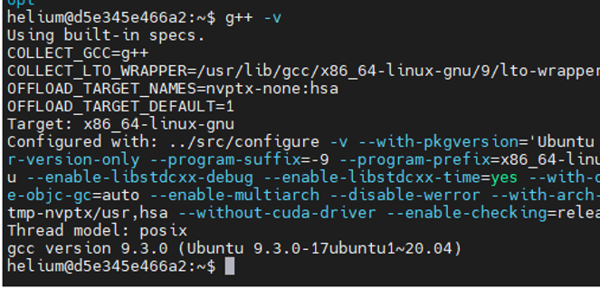
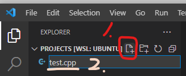
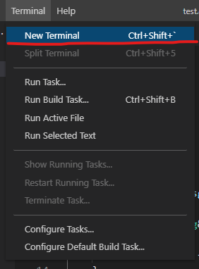
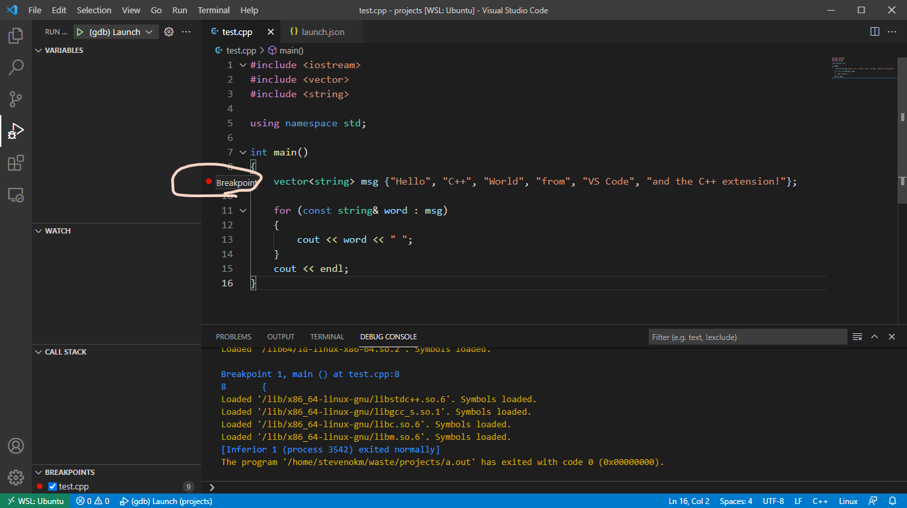
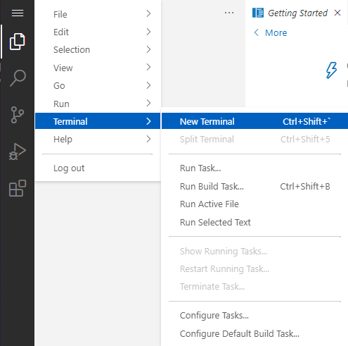
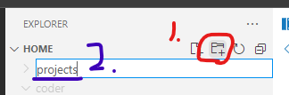

# Visual Studio Code Tutorial

## 設定 VSCode 環境 (Linux)

### 安裝 GCC

打開 **終端機** 輸入以下指令：

```bash
sudo apt update
sudo apt install -y build-essential g++ gdb
g++ -v
```

Wrong:


Correct:



### 安裝 VSCode & C++ plugin

Install VSCode: [https://code.visualstudio.com/docs/setup/linux](https://code.visualstudio.com/docs/setup/linux)

Install the C++ extension for VSCode: [https://marketplace.visualstudio.com/items?itemName=ms-vscode.cpptools](https://marketplace.visualstudio.com/items?itemName=ms-vscode.cpptools)

### 新增專案 (Hello world!)

在 **終端機** 輸入以下指令：

```console
$ mkdir projects
$ cd projects
$ code .
```

In VSCode: `Exploer -> New File`

輸入 `test.cpp`



在文字輸入區輸入以下程式碼

```c++
#include <iostream>
#include <vector>
#include <string>

using namespace std;

int main()
{
    vector<string> msg {"Hello", "C++", "World", "from", "VS Code", "and the C++ extension!"};

    for (const string& word : msg)
    {
        cout << word << " ";
    }
    cout << endl;
}
```


### 編譯 & 執行 Hello world!

In VSCode: `Terminal -> New Terminal`



In VSCode Terminal:
```console
$ g++ test.cpp
$ ./a.out
Hello C++ World from VS Code and the C++ extension! 
$ 
```

### Debugger

可以設置中斷點，方便程式除錯。

#### `launch.json`

In VSCode: `Exploer -> New Folder`

輸入 `.vscode`


In VSCode: `Exploer -> New File`

輸入 `launch.json`

在文字輸入區輸入以下設定檔

```json
{
    "version": "0.2.0",
    "configurations": [
        {
            "name": "(gdb) Launch",
            "type": "cppdbg",
            "request": "launch",
            "program": "${workspaceFolder}/a.out",
            "args": [],
            "stopAtEntry": false,
            "cwd": "${workspaceFolder}",
            "environment": [],
            "externalConsole": false,
            "MIMode": "gdb",
            "setupCommands": [
                {
                    "description": "Enable pretty-printing for gdb",
                    "text": "-enable-pretty-printing",
                    "ignoreFailures": true
                }
            ]
        }
    ]
}
```

#### 編譯 & 執行 Debugger

In VSCode Terminal:
```console
$ g++ -g test.cpp
$ 
```

插入中斷點

在要中斷的程式碼行號左邊點一下



In VSCode: `Run -> Start Debugging F5`


## 設定 VSCode 環境 (macOS)

### 安裝 g++

打開 **終端機** 輸入以下指令：

```bash
xcode-select --install
g++ -v
```

Wrong:


Correct:


### 安裝 VSCode & C++ plugin

Install VSCode: [https://code.visualstudio.com/docs/setup/mac](https://code.visualstudio.com/docs/setup/mac)

Install the C++ extension for VSCode: [https://marketplace.visualstudio.com/items?itemName=ms-vscode.cpptools](https://marketplace.visualstudio.com/items?itemName=ms-vscode.cpptools)

Note: 要加入 `code` 到環境變數 `PATH` 內。

1. 打開 **Command Palette** (<kbd>⌘</kbd> <kbd>Shift</kbd> <kbd>P</kbd>) 後輸入 `shell command`，就可以找到 **Shell Command: Install 'code' command in PATH**


2. 重新啟動 **終端機**

### 新增專案 (Hello world!)

在 **終端機** 輸入以下指令：

```console
$ mkdir projects
$ cd projects
$ code .
```

In VSCode: `Exploer -> New File`

輸入 `test.cpp`


在文字輸入區輸入以下程式碼

```c++
#include <iostream>
#include <vector>
#include <string>

using namespace std;

int main()
{
    vector<string> msg {"Hello", "C++", "World", "from", "VS Code", "and the C++ extension!"};

    for (const string& word : msg)
    {
        cout << word << " ";
    }
    cout << endl;
}
```


#### `settings.json`

In VSCode: `Exploer -> New Folder`

輸入 `.vscode`


In VSCode: `Exploer -> New File`

輸入 `settings.json`


在文字輸入區輸入以下設定檔

```json
{
    "C_Cpp.default.cppStandard": "c++17"
}
```

### 編譯 & 執行 Hello world!

In VSCode: `Terminal -> New Terminal`


In VSCode Terminal:
```console
$ g++ -std=c++17 -stdlib=libc++ test.cpp
$ ./a.out
Hello C++ World from VS Code and the C++ extension! 
$ 
```


### Debugger

可以設置中斷點，方便程式除錯。

#### 安裝 CodeLLDB plugin

Install the CodeLLDB extension for VSCode: [https://marketplace.visualstudio.com/items?itemName=vadimcn.vscode-lldb](https://marketplace.visualstudio.com/items?itemName=vadimcn.vscode-lldb)

#### `launch.json`

In VSCode:

選擇 `.vscode`

In VSCode: `Exploer -> New File`

輸入 `launch.json`

在文字輸入區輸入以下設定檔

```json
{
    "version": "0.2.0",
    "configurations": [
        {
            "name": "(gdb) Launch",
            "type": "lldb",
            "request": "launch",
            "program": "${workspaceFolder}/a.out",
            "args": ["-arg1", "-arg2"],
            "stopAtEntry": false,
            "cwd": "${workspaceFolder}",
            "environment": [],
            "externalConsole": false,
            "MIMode": "lldb",
            "setupCommands": [
                {
                    "description": "Enable pretty-printing for gdb",
                    "text": "-enable-pretty-printing",
                    "ignoreFailures": true
                }
            ]
        }
    ]
}
```

#### 編譯 & 執行 Debugger

In VSCode Terminal:
```console
$ g++ -std=c++17 -stdlib=libc++ -g test.cpp
$ 
```

插入中斷點

在要中斷的程式碼行號左邊點一下


In VSCode: `Run -> Start Debugging F5`


## 使用 VSCode server


### 安裝 GCC & C++ plugin

In VSCode: `Terminal -> New Terminal`



```console
sudo apt update
sudo apt install -y build-essential g++ gdb
g++ -v
curl -L https://github.com/microsoft/vscode-cpptools/releases/download/1.5.1/cpptools-linux.vsix --output cpptools-linux.vsix
code-server --install-extension cpptools-linux.vsix
```

NOTE: 須重新整理網頁才能生效

### 新增專案 (Hello world!)

In VSCode: `Exploer -> New Folder`

輸入 `projects`



In VSCode: `File -> Open Folder`


In VSCode: `Exploer -> New File`

輸入 `test.cpp`


在文字輸入區輸入以下程式碼

```c++
#include <iostream>
#include <vector>
#include <string>

using namespace std;

int main()
{
    vector<string> msg {"Hello", "C++", "World", "from", "VS Code", "and the C++ extension!"};

    for (const string& word : msg)
    {
        cout << word << " ";
    }
    cout << endl;
}
```


### 編譯 & 執行 Hello world!

In VSCode Terminal:
```console
$ g++ test.cpp
$ ./a.out
Hello C++ World from VS Code and the C++ extension! 
$ 
```

### Debugger

可以設置中斷點，方便程式除錯。

#### `launch.json`

In VSCode: `Exploer -> New Folder`

輸入 `.vscode`


In VSCode: `Exploer -> New File`

輸入 `launch.json`

在文字輸入區輸入以下設定檔

```json
{
    "version": "0.2.0",
    "configurations": [
        {
            "name": "(gdb) Launch",
            "type": "cppdbg",
            "request": "launch",
            "program": "${workspaceFolder}/a.out",
            "args": [],
            "stopAtEntry": false,
            "cwd": "${workspaceFolder}",
            "environment": [],
            "externalConsole": false,
            "MIMode": "gdb",
            "setupCommands": [
                {
                    "description": "Enable pretty-printing for gdb",
                    "text": "-enable-pretty-printing",
                    "ignoreFailures": true
                }
            ]
        }
    ]
}
```

#### 編譯 & 執行 Debugger

In VSCode Terminal:
```console
$ g++ -g test.cpp
$ 
```

插入中斷點

在要中斷的程式碼行號左邊點一下


In VSCode: `Run -> Start Debugging F5`


Reference: 

* [Get Started with C++ on Linux in Visual Studio Code](https://code.visualstudio.com/docs/cpp/config-linux)
* [Configure VS Code for Clang/LLVM on macOS](https://code.visualstudio.com/docs/cpp/config-clang-mac)