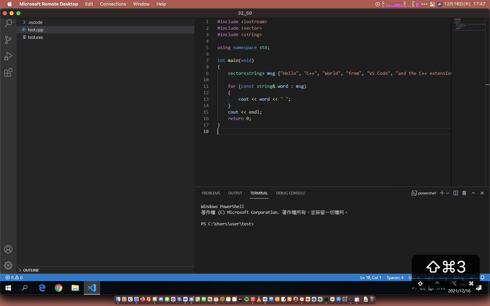

# Visual Studio Code Tutorial (315 classroom)

## 使用 VSCode 環境 

點擊兩下，打開桌面上的 `Visual Studio Code`。




在文字輸入區輸入以下程式碼

```c++
#include <iostream>
#include <vector>
#include <string>

using namespace std;

int main()
{
    vector<string> msg {"Hello", "C++", "World", "from", "VS Code", "and the C++ extension!"};

    for (const string& word : msg)
    {
        cout << word << " ";
    }
    cout << endl;
}
```


### 編譯 & 執行 Hello world!

In VSCode: `Terminal -> New Terminal`


In VSCode Terminal:
```console
$ g++ test.cpp
$ ./a.out
Hello C++ World from VS Code and the C++ extension! 
$ 
```

### 測試編譯以及除錯

#### 測試編譯

1. 點擊左方test.cpp檔案後，在要中斷的程式碼行號左邊點一下，會出現紅點，如下圖示範：


1. 按下`ctrl+shift+B`按鍵，或上方`terminal -> Run Build Task`，如下圖示範：


3. 此時上方會出現以下畫面，選擇中間選項使用 **g++** 編譯檔案，如下圖示範：


4. 設置正確的話，此時下方會出現編譯成功完成的提示，如下圖示範：


#### 測試除錯

1. 完成前項`測試編譯`的所有流程

2. 按下左方三角形按鈕後選擇`Run and Debug`，如下圖示範：


3. 此時上方會依序出現相關提示，選擇預設的即可，如下圖示範：


4. 若設定正確的話，會看到程式停留在選取的那一行，如下圖示範：


