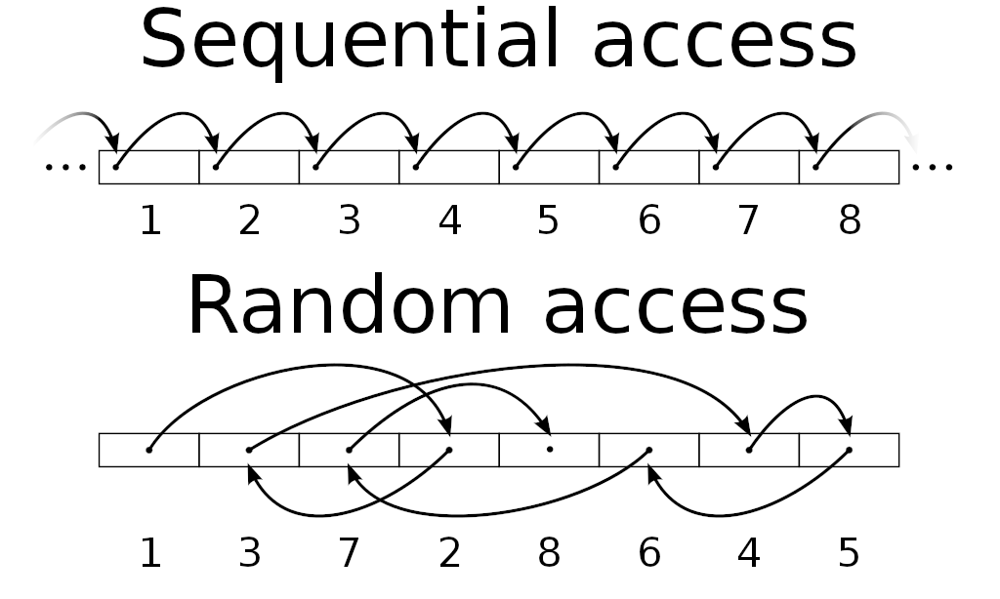

# Lecture 6-2: Array & String (1)

## What is Array?

將一個變數能夠儲存多個值，並且用數字進行編號 (index) 並且利用數字存取 (i.e. [random access](https://en.wikipedia.org/wiki/Random_access))



### Fibonacci number

$$ \begin{align} F_0 &= 0 \\\\
F_1 &= 1 \\\\
F_n &= F_{n-1} + F_{n-2}, n \ge 2 \end{align}$$

Modified from [fibonacci-time-analysis/fib.cpp at master · christopher-siewert/fibonacci-time-analysis (github.com)](https://github.com/christopher-siewert/fibonacci-time-analysis/blob/master/fib.cpp)

``` c++
#include <iostream>

int main()
{
    int n = 0;
    std::cout << "fib number: ";
    std::cin >> n;

    unsigned long long int f[100000]; /// array for values
    f[0] = 0;
    f[1] = 1;
    /// Loop from 2 to n
    for (int i = 2; i <= n; i++)
    {
        f[i] = f[i - 1] + f[i - 2]; /// Equals sum of previous 2
    }
    std::cout << f[n] << std::endl;
    return 0;
}
```

## character array (C String)

Credit: [htchen/i2p-nthu by 陳煥宗老師](https://github.com/htchen/i2p-nthu/tree/master/%E7%A8%8B%E5%BC%8F%E8%A8%AD%E8%A8%88%E4%B8%80)

```c++
#include <iostream>
#include <iomanip>
#include <cstring>

int main(void)
{
    float minutes, distance;
    const float SPEED = 0.083;
    int size, letters;
    char name[10];
    std::cout << "Hi! What's your first name? ";
    std::cin >> name;
    std::cout << std::endl
              << name
              << ", how many minutes does it take to walk from"
              << std::endl;
    std::cout << "your dormitory to the CS building? ";
    std::cin >> minutes;
    size = sizeof(name);
    letters = strlen(name);
    distance = minutes * SPEED;
    std::cout << std::endl
              << "The distance from your dormitory to the CS building"
              << std::endl;
    std::cout << "is about "
              << std::setprecision(3) << distance
              << " kilometers.\n\n";
    std::cout << "By the way, your first name has "
              << letters
              << " letters,\n";
    std::cout << "and we have "
              << size
              << " bytes to store it in.\n";
    return 0;
}
```

我們來看看這個程式做了哪些事情以及用到了哪些新的東西。
執行這個程式會得到類似下面的結果:

``` console
$ ./a.out
Hi! What's your first name? Stevie⏎

Stevie, how many minutes does it take to walk from
your dormitory to the CS building? 10⏎

The distance from your dormitory to the CS building
is about 0.83 kilometers.

By the way, your first name has 6 letters,
and we have 10 bytes to store it in.
```

程式先用 `std::cout` 顯示訊息，詢問使用者的名字，然後用 `std::cin` 來讀取使用者輸入的 "字串"，把字串儲存在變數name 裡面。
再來就可以用儲存起來的字串稱呼使用者，並且問一個簡單的問題，再把計算結果顯示在螢幕上。
程式裡面用到的新東西首先是 `#include <cstring>`。
回想當初程式需要 `#include <iostream>` 是因為要用到 `std::cout`，同樣地，引入 `cstring` 是為了要用到其中相關的 `function`，在這個例子用到的是 `strlen()` 這個 `function`，它可以計算字串變數裡面所儲存的字串的長度。
傳入的參數是字串，傳回的整數值就是字串長度，以 `Stevie` 為例，長度是 6。
字串其實是靠所謂的`character array` 來儲存。

```c++
char name[10];
```

表示 `name` 會佔用到十個 bytes 的記憶體，等於是有十個空位，每個空位的大小是一個 byte，每個 byte 的空間可以存放一個字元。

## 字元陣列 character arrays 與字串 ##

| S   | t   | e   | v   | i   | t   | \0  |
| --- | --- | --- | --- | --- | --- | --- |

字串裡的字元必須連續地存放在記憶體中，所以剛好可以用陣列來儲存，因為陣列就是一連串的記憶體空間。字元陣列的每一格空間可以存放一個字元 (`char`)，當我們宣告 `char name[10];` 表示要保留十格空間存放十個字元，每一格可以容
納一個 `char` 型別的資料。當然除了 `char` 之外，也可用其他型別如 `int` 來宣告陣列，目前我們先專心探討字元陣列。為了標記整個字串究竟在哪裡算是結尾，c++ 語言使用一個特殊的字元 `\0` 來表示字串結尾。字元 `\0` 對應到的 ASCII 值是 `0`。我們也可以用整數 `0` 來代替字元 `\0`，但為了有所區別，當字元使用時最好寫成 `\0`。

宣告一個字元變數和宣告一個陣列的差別可以用下圖來表示。

```c++
char ch;   // 佔用一個 byte，型別為 char
char name[10];　// 佔用十個 bytes，型別為 char
```

宣告陣列產生一個可以容納十個字元的 array，準備用來記錄使用者輸入的字串 (使用者的名字)。
因為要保留一格給 `\0` 字元來標示字串結尾，所以其實真正能用來記錄的人名長度，最多只能包含九個字元。
如何把字串存入陣列中呢？在前面的例子裡用的方法是 `std::cin >> name;` 讀取使用者輸入的字串。
參數 name 就是要存放字串的陣列名稱，這個名稱所代表的意義是整個字串的開頭位址。
因此 `std::cin`就能由 name 找到陣列開頭位址，一格一格把字元填進去，而且會自動在最後加上 `\0` 當作結束。

再回到範例，裡面用到 sizeof，它可以計算型別 (譬如 `sizeof(float)`) 或資料 (譬如 `sizeof(name)` 或 `sizeof("Stevie")`) 的 byte 數。
若把它用在宣告過的陣列上，它會告訴我們陣列有多少個bytes，如果是 `char name[10];` 就是 10 bytes。另外 `#include <cstring>` 是為了用 `strlen()` 這個 function，它是針對字串而設計的function，可以算出字串長度。
字串長度是靠 `\0` 來界定，所以如果把某個字串當參數傳給 `strlen()`，它就會一個字元一個字元地數，直到遇到 `\0'`就停下來，然後回報字串長，看看底下例子中的差異：

```c++
#include <iostream>
#include <cstring>
int main(void)
{
    std::cout << "The length of string is "
              << strlen("Stevie")
              << ", but "
              << sizeof("Stevie")
              << " bytes are occupied.\n";
    return 0;
}
```

Reference:
* [htchen/i2p-nthu by 陳煥宗老師](https://github.com/htchen/i2p-nthu/tree/master/%E7%A8%8B%E5%BC%8F%E8%A8%AD%E8%A8%88%E4%B8%80)
* [CNOCycle/cpp_tutorial by E. Chen](https://github.com/CNOCycle/cpp_tutorial)