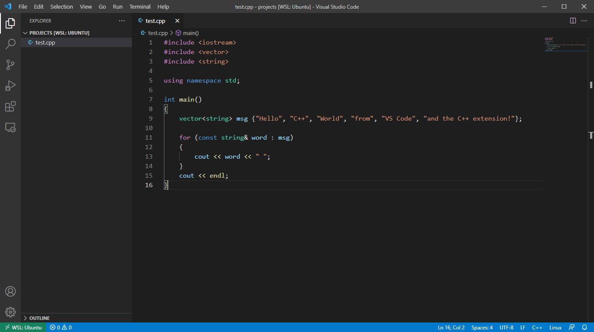

# Visual Studio Code Tutorial (315 classroom)

## 使用 VSCode 環境 

在文字輸入區輸入以下程式碼

```c++
#include <iostream>
#include <vector>
#include <string>

using namespace std;

int main()
{
    vector<string> msg {"Hello", "C++", "World", "from", "VS Code", "and the C++ extension!"};

    for (const string& word : msg)
    {
        cout << word << " ";
    }
    cout << endl;
}
```



### 編譯 & 執行 Hello world!

In VSCode: `Terminal -> New Terminal`


In VSCode Terminal:
```console
$ g++ test.cpp
$ ./a.out
Hello C++ World from VS Code and the C++ extension! 
$ 
```

### Debugger

可以設置中斷點，方便程式除錯。

#### `launch.json`

In VSCode: `Exploer -> New Folder`

輸入 `.vscode`


In VSCode: `Exploer -> New File`

輸入 `launch.json`

在文字輸入區輸入以下設定檔

```json
{
    "version": "0.2.0",
    "configurations": [
        {
            "name": "(gdb) Launch",
            "type": "cppdbg",
            "request": "launch",
            "program": "${workspaceFolder}/a.out",
            "args": [],
            "stopAtEntry": false,
            "cwd": "${workspaceFolder}",
            "environment": [],
            "externalConsole": false,
            "MIMode": "gdb",
            "setupCommands": [
                {
                    "description": "Enable pretty-printing for gdb",
                    "text": "-enable-pretty-printing",
                    "ignoreFailures": true
                }
            ]
        }
    ]
}
```

#### 編譯 & 執行 Debugger

In VSCode Terminal:
```console
$ g++ -g test.cpp
$ 
```

插入中斷點

在要中斷的程式碼行號左邊點一下


In VSCode: `Run -> Start Debugging F5`


